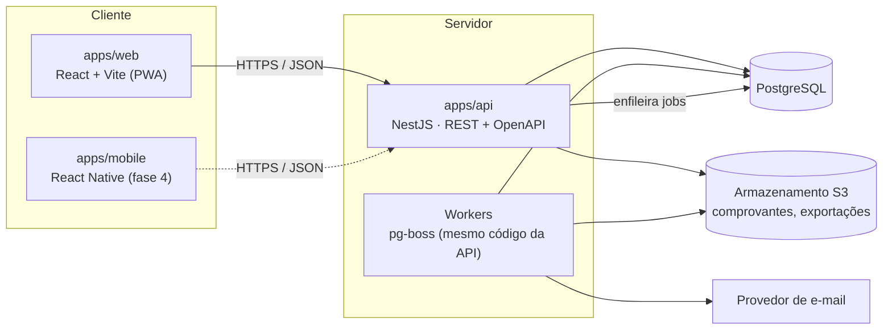
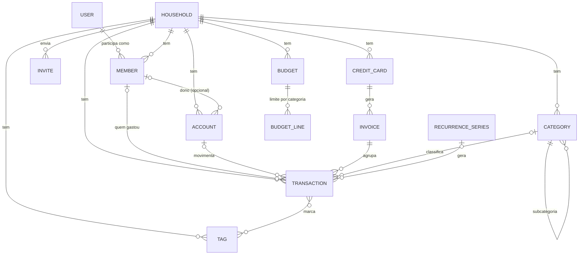

# Arquitetura do NX-Balance

O NX-Balance é um monorepo TypeScript com uma API NestJS, que concentra todas as regras de negócio, e um PWA em React que só apresenta os dados e coleta entradas. O app nativo (fase 4) vai consumir a mesma API. Todo dado financeiro pertence a um **Lar** e toda consulta é filtrada por ele.

Requisitos: [spec/especificacao-funcional.md](spec/especificacao-funcional.md). Decisões e seus motivos: [decisoes/](decisoes/).

## 1. Visão de componentes



- **API e workers usam o mesmo código.** O processo sobe em modo `api` ou `worker`. As filas ficam no próprio PostgreSQL (pg-boss), sem Redis ([ADR-0005](decisoes/0005-jobs-pg-boss.md)).
- **O web não tem regra de negócio.** Ele pode usar `packages/core` para mostrar prévias (divisão de parcelas, fatura provável), mas o valor gravado é sempre o que a API calcular.

## 2. Estrutura do repositório

```
nx-balance/
├── apps/
│   ├── api/                  # NestJS: HTTP, workers, Prisma
│   │   ├── prisma/           # schema.prisma, migrations, seed (categorias padrão)
│   │   ├── src/
│   │   │   ├── main.ts       # bootstrap modo api | worker
│   │   │   ├── common/       # guards, filtros de erro, contexto do Lar, paginação
│   │   │   ├── infra/        # prisma, jobs, e-mail, storage, config
│   │   │   └── modules/      # um módulo por contexto de domínio (seção 3)
│   │   └── test/             # testes de integração (banco real) e e2e da API
│   ├── web/                  # React + Vite + PWA
│   │   └── src/
│   │       ├── app/          # rotas, layout (menu inferior no celular, lateral no desktop)
│   │       ├── features/     # uma pasta por contexto: telas, hooks, componentes
│   │       ├── components/ui # shadcn/ui + componentes do design system
│   │       └── lib/          # cliente da API, formatação, auth
│   └── mobile/               # fase 4
├── packages/
│   ├── core/                 # domínio puro, sem I/O: dinheiro, datas, parcelas, ciclo da fatura
│   ├── contracts/            # schemas Zod de request/response compartilhados (API ⇄ web ⇄ mobile)
│   └── config/               # tsconfig, eslint, prettier, vitest compartilhados
├── docs/                     # especificação, arquitetura, roadmap, fases, decisões
├── docker-compose.yml        # postgres, mailpit, minio (dev)
├── turbo.json
└── pnpm-workspace.yaml
```

Regra de dependência: `apps/*` → `packages/contracts` → `packages/core`. O `core` não depende de nada do projeto. Nenhum `app` importa de outro `app`.

## 3. Módulos de domínio (apps/api/src/modules)

| Módulo | Entidades | Requisitos | Fase |
| --- | --- | --- | --- |
| `auth` | User, Session, EmailToken | RF-01, RF-13.6 | M1 |
| `households` | Household (Lar), Member, Invite | RF-02 | M1 |
| `accounts` | Account | RF-03 | M2 |
| `categories` | Category, Tag | RF-05 | M2 |
| `transactions` | Transaction, Attachment | RF-04 | M3 |
| `recurrences` | RecurrenceSeries | RF-06 | M4 |
| `cards` | CreditCard, Invoice | RF-07 | M5 |
| `payables` | (visão sobre Transaction/Invoice) | RF-08 | M6 |
| `budgets` | Budget, BudgetLine | RF-09 | M6 |
| `reports` | (consultas agregadas) | RF-10 | M7 |
| `imports` | ImportBatch, ImportRow | RF-11 | M8 |
| `notifications` | Notification, NotificationPreference | RF-12 | M9 |
| `privacy` | Consent, DataExport | RF-13 | M1 / M10 |
| `audit` | AuditLog | RF-02.8, RNF-12 | M3 / M10 |

Cada módulo segue a mesma estrutura em camadas:

```
modules/<contexto>/
├── <contexto>.module.ts
├── <contexto>.controller.ts   # HTTP: valida com schemas de packages/contracts, chama o service
├── <contexto>.service.ts      # casos de uso: permissões, transações de banco, regras
├── <contexto>.repository.ts   # acesso ao Prisma, sempre escopado ao Lar
└── <contexto>.*.spec.ts       # testes unitários e de integração
```

Cálculos puros (saldo, parcelas, fatura, orçamento) ficam em `packages/core` e têm testes unitários exaustivos. O service orquestra e o repository persiste.

## 4. Modelo de dados (visão inicial)



Pontos centrais do modelo:

- **`household_id` em toda tabela de dados financeiros**, com índice composto começando por ele ([ADR-0002](decisoes/0002-isolamento-por-lar.md)).
- **Member separado de User.** Um Member pode existir sem User (membro sem login, RF-02.4) e ser vinculado a um User depois, sem perder o histórico. Os papéis (`ADMIN`, `EDITOR`, `VIEWER`) ficam no Member.
- **Transaction** tem `type` (`INCOME` | `EXPENSE` | `TRANSFER`), `amount_cents` (sempre positivo), `date` (competência), `status` (`PAID` | `PENDING`) e referência a `account_id` **ou** `card_id`. Uma transferência gera duas linhas ligadas por `transfer_group_id`, uma de saída e uma de entrada, que são excluídas juntas.
- **Série de recorrência ou parcelamento.** A `RecurrenceSeries` guarda a regra. As ocorrências são Transactions `PENDING` com `series_id` e `series_index`, geradas até 12 meses à frente (a recorrência) ou até a última parcela (o parcelamento).
- **Invoice (fatura)** tem período, vencimento, status e total derivado. A compra no cartão é uma Transaction `EXPENSE` com `card_id` + `invoice_id`, contada pela data da compra. O pagamento da fatura é uma movimentação da conta para o cartão e **não** conta como despesa, o que evita contar o mesmo gasto duas vezes.
- **Saldo nunca é gravado.** O saldo é `saldo_inicial + Σ lançamentos efetivados até hoje`. Se o desempenho exigir, entra depois uma tabela de saldo mensal consolidado como cache, recalculável.

O schema definitivo nasce em `apps/api/prisma/schema.prisma` e é detalhado no plano de cada etapa.

## 5. Regras transversais

| Tema | Regra | Onde |
| --- | --- | --- |
| Isolamento | Toda consulta passa pelo contexto do Lar (`HouseholdContext`), vindo do token e validado pelo vínculo de Member; nunca de parâmetro livre | [ADR-0002](decisoes/0002-isolamento-por-lar.md) |
| Dinheiro | Inteiro em centavos (`bigint` no banco, `number` no TS); nunca `float`; formatação só na borda (web) | [ADR-0003](decisoes/0003-dinheiro-e-datas.md) |
| Datas | Competência é `date` sem hora; eventos são `timestamptz`; fuso padrão `America/Sao_Paulo`; o mês financeiro respeita o "primeiro dia do mês" do Lar (RF-13.2) | [ADR-0003](decisoes/0003-dinheiro-e-datas.md) |
| Autenticação | Access token JWT curto (15 min) + refresh token rotativo em cookie `httpOnly` ligado a uma Session no banco; senha com Argon2id | [ADR-0004](decisoes/0004-autenticacao-e-sessoes.md) |
| Autorização | Guard por papel (`@Roles('EDITOR')`) + verificação de dono em contas privadas (RF-02.7) | `common/guards` |
| Validação | Schemas Zod em `packages/contracts`, usados pela API (pipe) e pelo web (formulários) | `packages/contracts` |
| Erros | Formato único `{ code, message, details? }`; `code` estável para o front traduzir | `common/filters` |
| Auditoria | Criar, editar ou excluir um lançamento grava AuditLog (quem, quando, antes e depois) | módulo `audit` |
| API | REST versionada (`/v1`), OpenAPI gerado em `/docs`, paginação por cursor no extrato (RNF-16) | — |

## 6. Stack

| Camada | Escolha |
| --- | --- |
| Monorepo | pnpm workspaces + Turborepo |
| Linguagem | TypeScript (modo `strict`) em tudo |
| API | NestJS, Prisma ORM, PostgreSQL 16, Zod (`nestjs-zod`), pg-boss, Argon2, Pino (logs) |
| Web | React, Vite, TanStack Router, TanStack Query, Tailwind CSS, shadcn/ui, React Hook Form + Zod, Recharts, `vite-plugin-pwa` |
| Testes | Vitest (core, api, web), Testcontainers ou banco de teste no Docker (integração), Playwright (e2e web) |
| Dev local | Docker Compose: PostgreSQL, Mailpit (e-mail), MinIO (S3) |
| CI | GitHub Actions: lint, typecheck, testes, build |
| Hospedagem | A decidir antes da etapa M10 (ADR pendente) |

## 7. Ambientes (RNF-18)

| Ambiente | Uso | Dados |
| --- | --- | --- |
| `dev` | Máquina local via Docker Compose | Seed fictício |
| `homolog` | Validação antes de produção; deploy automático da branch `main` | Fictícios |
| `prod` | Uso real; deploy por tag de versão | Reais, com backup diário criptografado e retenção de 30 dias (RF-13.9, RNF-11) |
