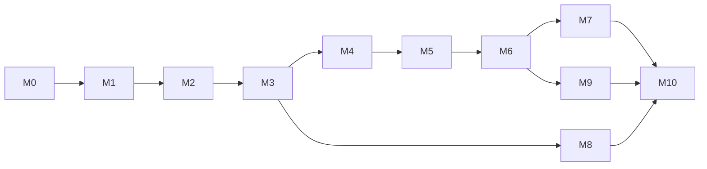

# Roadmap e status

**Agora:** M0 — Fundação (não iniciada). **Próximo marco:** MVP Web completo (M0–M10) em uso real pela família.

Este é o painel do projeto. Cada etapa tem um arquivo em [fases/](fases/) com o checklist de requisitos e tarefas. Este arquivo mostra só o resumo e é atualizado sempre que uma etapa muda de status.

**Legenda:** ⬜ Não iniciada · 🟨 Em andamento · 🟦 Em revisão · ✅ Concluída · ⛔ Bloqueada

## Fase 1 — MVP Web (P1 + P2)

| Etapa | Entrega | Requisitos | Depende de | Status | Progresso |
| --- | --- | --- | --- | --- | --- |
| [M0](fases/M0-fundacao.md) | Fundação: monorepo, infraestrutura local, CI, `core` de dinheiro e datas | RNF-13, 14, 18, 19 | — | ⬜ | 0/9 |
| [M1](fases/M1-identidade-e-lar.md) | Cadastro, login, Lar, membros, convites, papéis, shell do app | RF-01, RF-02, RF-13.1/13.3/13.7 | M0 | ⬜ | 0/15 |
| [M2](fases/M2-contas-e-categorias.md) | Contas financeiras, categorias, subcategorias e tags | RF-03, RF-05, RF-02.7 | M1 | ⬜ | 0/18 |
| [M3](fases/M3-lancamentos.md) | Lançamentos, transferências, extrato, anexos e auditoria | RF-04, RF-02.8 | M2 | ⬜ | 0/11 |
| [M4](fases/M4-recorrencias-e-parcelamentos.md) | Recorrências e parcelamentos | RF-06 | M3 | ⬜ | 0/9 |
| [M5](fases/M5-cartoes-e-faturas.md) | Cartões de crédito e faturas | RF-07 | M4 | ⬜ | 0/12 |
| [M6](fases/M6-contas-a-pagar-e-orcamento.md) | Contas a pagar e a receber, orçamento mensal, mês financeiro | RF-08, RF-09, RF-13.2 | M5 | ⬜ | 0/13 |
| [M7](fases/M7-dashboard-e-relatorios.md) | Dashboard e relatórios | RF-10 | M6 | ⬜ | 0/16 |
| [M8](fases/M8-importacao.md) | Importação de extratos OFX e CSV | RF-11 | M3 | ⬜ | 0/7 |
| [M9](fases/M9-notificacoes.md) | Notificações e alertas (sino, e-mail, navegador) | RF-12, RF-08.7, RF-09.6 | M6 | ⬜ | 0/10 |
| [M10](fases/M10-lgpd-e-producao.md) | LGPD, segurança, PWA, desempenho e ida para produção | RF-13.4/13.5/13.6/13.8/13.9, RNF-04–12, RNF-15–18 | M1–M9 | ⬜ | 0/19 |

A etapa M8 depende só de M3 e pode andar em paralelo a M4–M7.

**Critério para encerrar a fase 1:** as etapas M0 a M10 concluídas, a produção no ar e a família usando o sistema de verdade por 1 a 2 meses.

## Fases seguintes

| Fase | Conteúdo | Critério de entrada | Status |
| --- | --- | --- | --- |
| 2. Planejamento | Itens P3 da web: RF-02.6 (vários Lares), RF-04.10 (dividir lançamento), RF-05.8 (regras automáticas), RF-09.8 (orçamento por membro), RF-09.9 (sobra acumulada), RF-10.9 (blocos do dashboard), RF-10.18 (relatório em PDF), RF-11.8 (importar planilha); metas, projeção de saldo, divisão de despesas entre membros | Uso real pela família por 1 a 2 meses | ⬜ |
| 3. Comercialização | Planos gratuito e pago, cobrança recorrente, limites por plano, onboarding, site de vendas, suporte, revisão jurídica | Beta fechado com famílias convidadas | ⬜ |
| 4. App nativo | iOS e Android (React Native, mesma API), push, biometria, offline, câmera, widget | Primeiros assinantes pagantes na web | ⬜ |
| 5. Automação e IA | Open Finance via agregador, leitura de notificações (Android), assistente com IA, insights, investimentos | App publicado nas lojas | ⬜ |

Cada fase seguinte ganha seus próprios arquivos de etapa quando a anterior cumprir o critério.

## Histórico

| Data | Evento |
| --- | --- |
| 2026-09-27 | Especificação funcional aprovada; arquitetura, ADRs 0001–0005 e plano de etapas criados |
